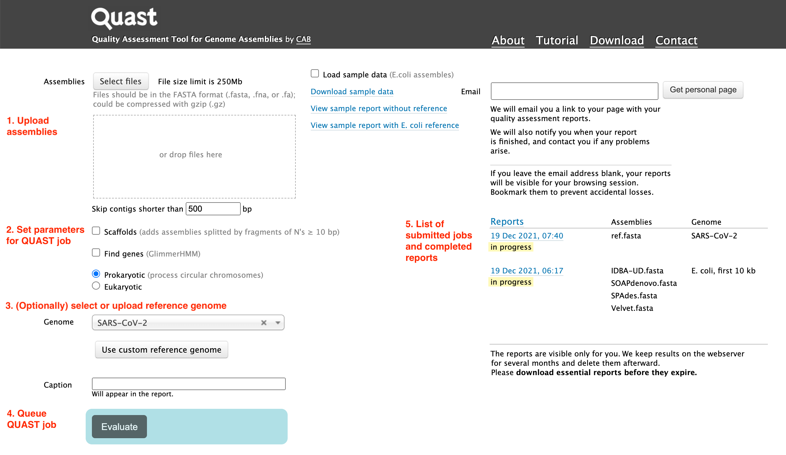
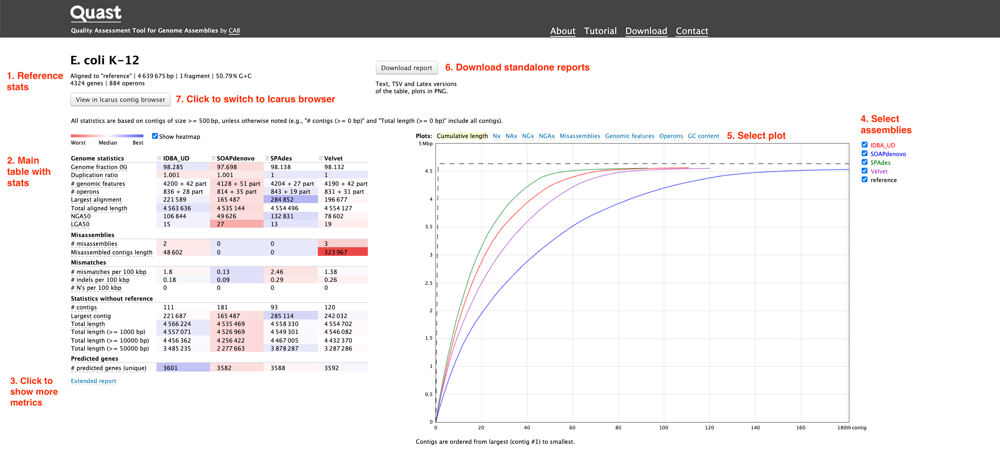
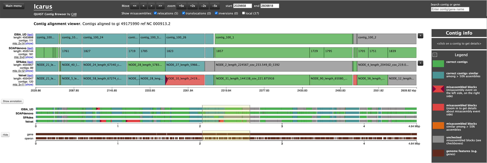

## Help

This page will guide you step-by-step from submitting your data to interpreting the results. This page also contains info on the [browser compatibility](#compatibility), so if something is not working correctly, please [let us know](contact.md) and consider changing your browser as a possible workaround.

If you are new to QUAST, you may want to check out the [About](about.md) page first.  
If you are an advanced QUAST user, you may want to consult the [online manual](http://cab.cc.spbu.ru/quast/manual.html) instead, e.g., detailed [quality metric descriptions](http://cab.cc.spbu.ru/quast/manual.html#sec3.1) or [FAQ](http://cab.cc.spbu.ru/quast/manual.html#sec7).  
If you didn't find answers here or there, [ask us](contact.md)!

### Submitting your data

1. QUAST expects assemblies in the form of `.fasta/.fa` files, optionally compressed with gzip. You can upload your files via a file selection dialogue using "Select files" button, or just drag and drop them into the "drop files here" field. 

2. You can parametrize your QUAST job, e.g.: whether your sequences are scaffolds, whether you want to enable gene detection, and whether the genome is circular.

3. QUAST can work without a reference genome. However, if a model genome for an organism is available, QUAST would be able to report many more interesting results. You can upload a reference genome though the "Genome" selection menu.  A set of popular genomes are already pre-uploaded.

4. Press "Evaluate" to queue a QUAST job. Normally it will be run immediately, however in the periods of high load it might take longer for a job to start. Before submitting, you can title your job using the "Caption" text field, otherwise a current timestamp would be used as a default title.

5. Your submitted jobs will appear on the right side of the main page. Clicking on a title will send you to the job page, which will have a QUAST report once it's completed. For heavy jobs, you can your add your email address, and you will be notified when your jobs are completed.

### Interpreting the output

1. If a reference genome was provided, its basic characteristics will shown on the top.

2. The main table summarizes all quality metrics for given assemblies. See QUAST documentation for details on reported metrics: http://quast.sourceforge.net/docs/manual.html#sec3.1. The web page provides some convenient UI that allows you to:
	* Reorder columns using drag and drop.
	* Use color scheme to range values from the worst (red) to the best (blue).
	* Point over a metric name for a tooltip with an explanation of this metric.

3. More metrics are available by clicking on "Extended report".
4. Checkboxes on the left allow to select assemblies that would be displayed on the plots.
5. Users can switch between different plots by clicking on the tabs.
6. A standalone version of the report is available for downloading. In addition, a tarball contains Latex and tab-separated versions of the table suitable for parsing, along with plots in PDF.
7. You can view the assembly in Icarus contig browser.

### Icarus browser

### Browser compatibility

| OS      | Version           | Chrome | Firefox | Edge | Safari |
| --------| ------------------|--------|---------|------|--------|
| Linux   | CentOS 7          | not tested | not tested | not tested | not tested |
| MacOS   | Big Sur 11.6.1    | 96.0.4664.93 (Official Build) (x86_64) | 94 | not tested  | Version 15.2 (16612.3.6.1.8, 16612) |
| Windows | 10 	              | 95.0.4638.54 (Official Build) (64-bit) | 94 | not tested | not tested |

